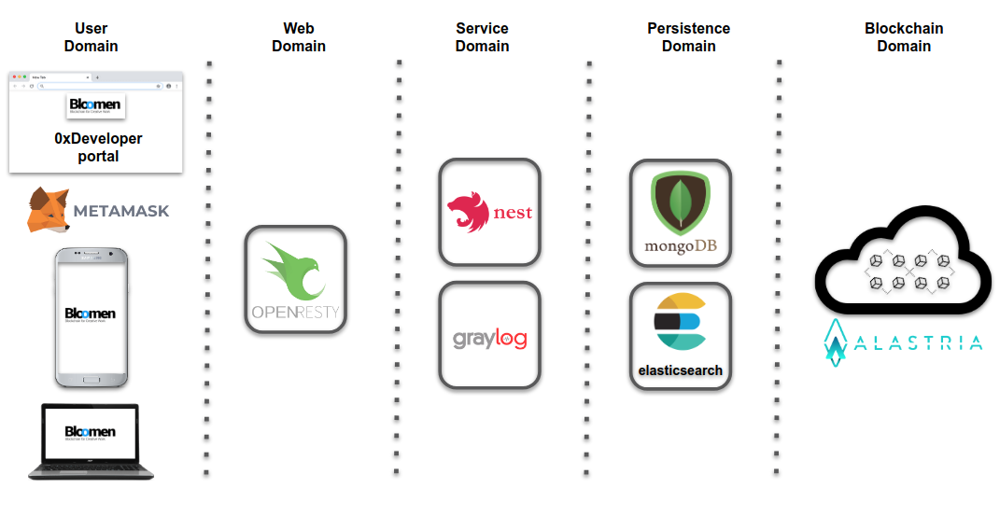

# Bloomen Developer Portal

This repository offers access to the different modules used in the construction of the Bloomen Developer Portal. This portal offers developer the ability to manage access to the blockchain of their developments and limit the use according to needs.

## Objective

The ultimate goal of any application that uses blockchain technology is to allow the end user to process transactions that modify the status of the different smart contracts hosted on the ledger.

This access to resources has to be public but it is not a good practice to offer open access to a blockchain network since we may have DDoS problems or unwanted access. It is for this reason that an ApiKeys management solution has been designed that allows end users the necessary access to send transactions without losing the ability to regulate this access or even cut it in specific cases.

In order to have a closed and sustainable ecosystem, it is necessary to use [Bloomen Tokens](https://github.com/bloomenio/bloomen-token) to buy access time to a specific ApiKey.

## Domains

The different modules of the portal can be distributed in different domains according to the type of service they provide.

 

We can see that the layer system offers us the ability to manage access to the resources offered by our nodes connected to the blockchain network.

## Modules

#### Openresty

[OpenResty®](https://openresty.org/en/) is a full-fledged web platform that integrates our enhanced version of the [Nginx](https://openresty.org/en/nginx.html) core, our enhanced version of [LuaJIT](https://github.com/openresty/luajit2), many carefully written Lua libraries, lots of high quality [3rd-party Nginx modules](https://openresty.org/en/components.html), and most of their external dependencies. It is designed to help developers easily build scalable web applications, web services, and dynamic web gateways.

#### [Portal api](portal/api/README.md)

API created to serve the portal user interface has been developed with [Nestjs](https://nestjs.com/). This API uses a [Mongodb](https://www.mongodb.com/) database for the persistence layer and interacts with the blockchain through the [web3](https://github.com/ethereum/web3.js) library.

#### [Portal app](portal/app/README.md)

The portal is a SPA (Single Page Application) developed in [Angular](https://angular.io/) that allows the developer to manage the apikeys that allow end user interaction with the blockchain.

#### [Portal smart contract (truffle)](portal/truffle/README.md)

The business logic of the application has been developed in smart contracts deployed on Alastria Blockchain.

#### Portal monitor (graylog)

In order to visualize the use that is being given to the provided infrastructure, a logging system has been configured. These stored logs allow you to generate a Dashboard that allows you to observe the general state of the platform.

The metrics stored in the system would allow to add new data visualization widgets if necessary. The dashboard and logging engine configuration can be found in the documentation of the tool itself [Graylog documentation](http://docs.graylog.org/en/stable/index.html).

# Live view

- [Developer portal](https://0x.wlilab.eu/dev-portal/)
- [Developer portal API](https://0x.wlilab.eu/dev-portal-api/docs/)
- [Graylog Dashboard](https://0x.wlilab.eu/graylog/)

# Do it yourself

> Install Docker version 18.09.9-ce or higher.

> Install Docker-compose version 1.21.0 or higher.

### Clone

    git clone https://github.com/bloomenio/bloomen-developer-portal.git

### Install

    cd bloomen-developer-portal
    cp .env.example .env
     -- fill .env file with your configuration data.    
    docker-compose build
    docker-compose up -d

### Enjoy

    http://localhost:8000/dev-portal
